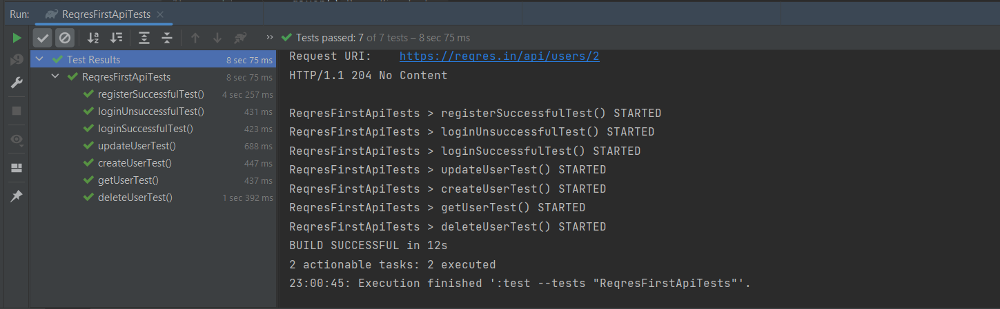
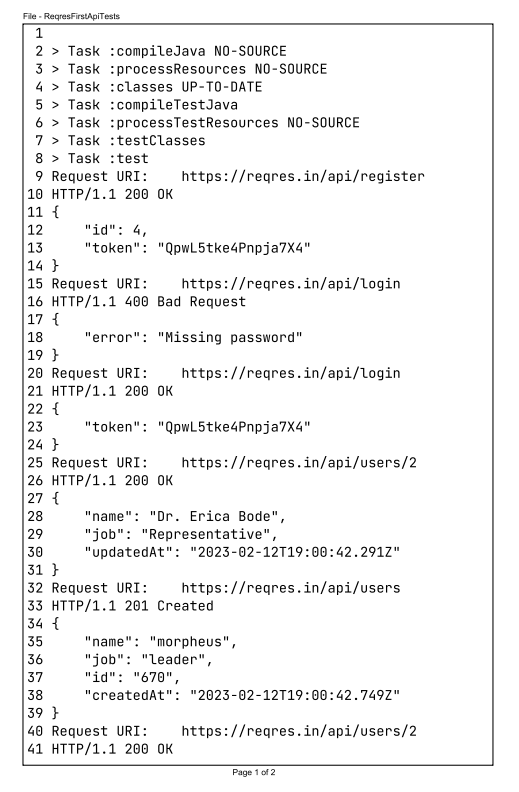
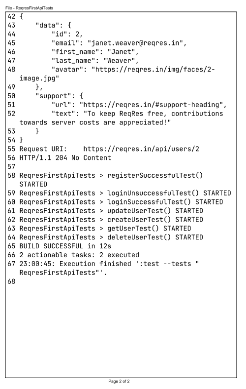

## Простые автотесты на сайт [reqres.in](https://reqres.in/) на REST API c REST Assured 
________

###  Чек-лист
1. сделать запрос (GET, POST, PUT, DELETE), передавая/не передавая тело запроса
2. получить ответ
3. сравнить полученный ответ с ожидааемым 

### Результаты 

   

